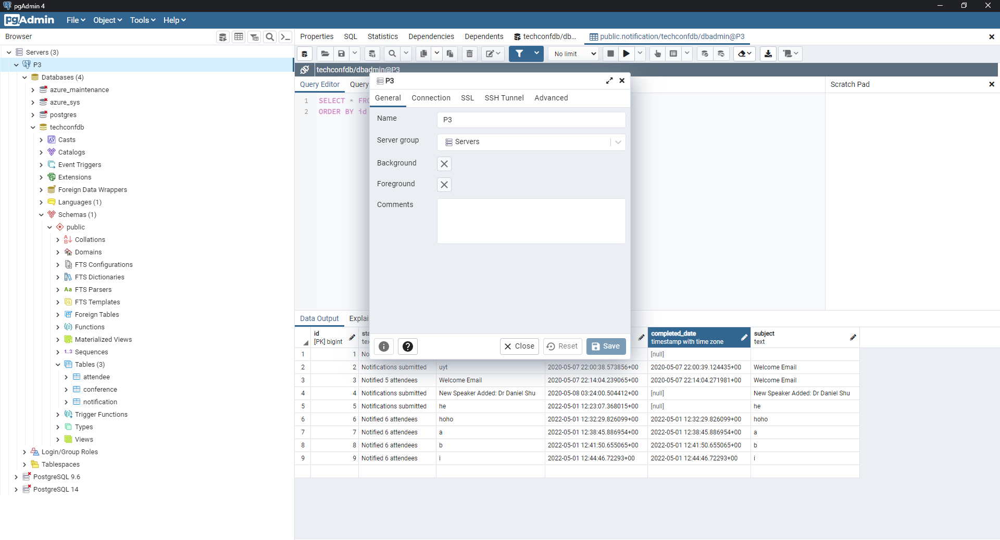
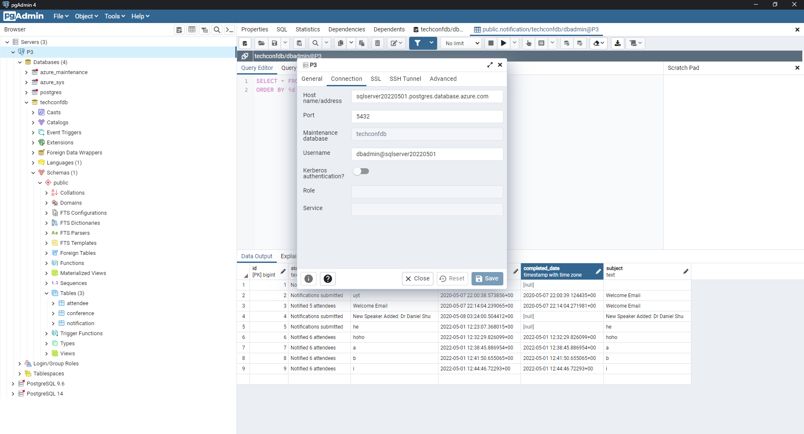
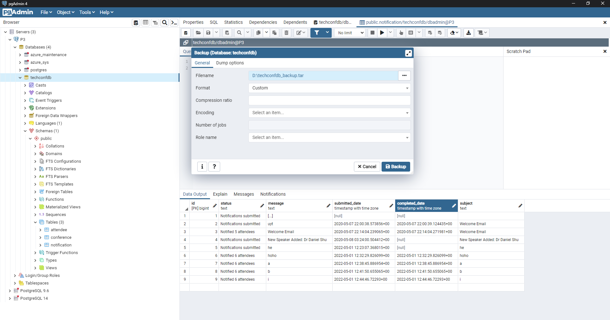
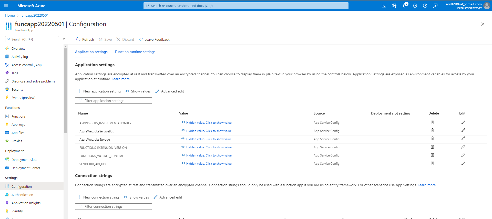

# TechConf Registration Website

## Project Overview
The TechConf website allows attendees to register for an upcoming conference. Administrators can also view the list of attendees and notify all attendees via a personalized email message.

The application works but the following pain points have triggered the need for migration to Azure:
 - The web application is not scalable to handle user load at peak.
 - When the admin sends out notifications, it's currently taking a long time because it's looping through all attendees, resulting in some HTTP timeout exceptions.
 - The current architecture is not cost-effective.

I migrated the application to Azure in the following steps: 
- Migrate a PostgreSQL database to an Azure Postgres database instance
- Refactor the notification logic to an Azure Function via a service bus queue message
- Migrate and deploy the web app to an Azure App Service

## Dependencies

You will need to install the following locally:
- [Postgres](https://www.postgresql.org/download/)
- [Visual Studio Code](https://code.visualstudio.com/download)
- [Azure Function tools V3](https://docs.microsoft.com/en-us/azure/azure-functions/functions-run-local?tabs=windows%2Ccsharp%2Cbash#install-the-azure-functions-core-tools)
- [Azure CLI](https://docs.microsoft.com/en-us/cli/azure/install-azure-cli?view=azure-cli-latest)
- [Azure Tools for Visual Studio Code](https://marketplace.visualstudio.com/items?itemName=ms-vscode.vscode-node-azure-pack)

## Migrate the Web App to Azure

1. Create the PostgreSql server in Azure by running the command below. 
    ```
    bash postgresql.sh
    ```
2. Open pgAdmin, connect to the Azure PostgreSql server, restore the database from [techconfdb_backup.tar]. 
    
    
    
3. Initiate the Azure Functions and update the [__init__.py] file to customize the function. Refactor the post logic in `web/app/routes.py -> notification()` using servicebus `queue_client`.  

   ```bash
   # initiate local python environment
   pipenv shell
   pipenv install

   # initiate a local project folder
   func init function --python

   cd function

   # initiate a function
   func new --name QueueTrigger --template "Azure Service Bus Queue trigger" --language python
   ``` 
4. Create the function app resources in Azure by running the command below. 
    ```
    bash funcapp.sh
    ```
5. Create the service bus resources in Azure by running the command below. 
    ```
    bash servicebus.sh
    ```

6. Update "AzureWebJobsStorage", "AzureWebJobsServiceBus" and "SENDGRID_API_KEY" in local.settings.json and the function app configuration from the Azure portal. 
    
    Update "queueName" and "connection" in function.json. 

    Update the following in the `config.py` file: 
      - `POSTGRES_URL`
      - `POSTGRES_USER`
      - `POSTGRES_PW`
      - `POSTGRES_DB`
      - `SERVICE_BUS_CONNECTION_STRING`
7. Test the function app and webapp locally.
   ```bash
   cd function

   # initiate local python environment
   pipenv shell
   pipenv install

   # test func locally
   func start
   ``` 
    ```bash
    cd web

    # install dependencies
    pipenv install

    # go into the shell
    pipenv shell

    # test the webapp locally
    python application.py   
    ```
8. Deploy the function app and the webapp with Azure.
    ```bash
    cd function

    # install dependencies
    pipenv install

    # go into the shell
    pipenv shell

    # deploy Azure Functions
    func azure functionapp publish funcapp20220501
    ```
    ```bash
    cd web

    # install dependencies
    pipenv install

    # go into the shell
    pipenv shell

    # deploy the webapp 
    az webapp up --resource-group group20220501 --name techconf2022 --sku F1 
    ```
9. Test the webapp by using the registration and send notification functions. 

## [Monthly Cost Analysis](https://azure.microsoft.com/en-us/pricing/calculator/)

| Azure Resource | Service Tier | Monthly Cost |
| ------------ | ------------ | ------------ |
| *Azure Postgres Database* | General Purpose | $192.85       |
| *Azure Service Bus*   |   Basic      |     $0.05         |
| *Azure App Service*   |   F1:Free      |       $0.00       |
| *Azure Function App*   |   Consumption   |    $0.00         |
| *Azure Storage*   |   Standard      |       $21.15       |
## Architecture Explanation
- The Web App is the best choice because it easy to scale and handle load balancing when users spike high. We can scale out or scale up the web apps instances to support the load. We can also configure auto-scale to web apps based on some metrics like CPU percentage, RAM Utilization, etc.[Source](https://www.dotnettricks.com/learn/azure/creating-web-app-tutorial-pricing)
- The Function App is very easy to extend and it have no timeout exceptions when the admin sends out notifications. Azure functions uses compute-on-demand, which is scalable by design. When demand of execution increases, more resources are allocated automatically to the service and when requests fall, all extra resources and application instances drop off automatically. [Source](https://www.c-sharpcorner.com/article/why-and-when-to-use-azure-functions/)
- This architecture it is an economical choice and very reasonable price for users. Web Application and Function Application can be used in the free tier and also scale up or down basead on the trafic of my app. Given that we have decoupled the app into frontend and functions also we enable the ability to do separate releases and scales which is better for the cost-effectiveness. Because we have separated into separate sections including frontend and functions so we enable the ability to do separate releases and scales which is better for the cost-effectiveness.
